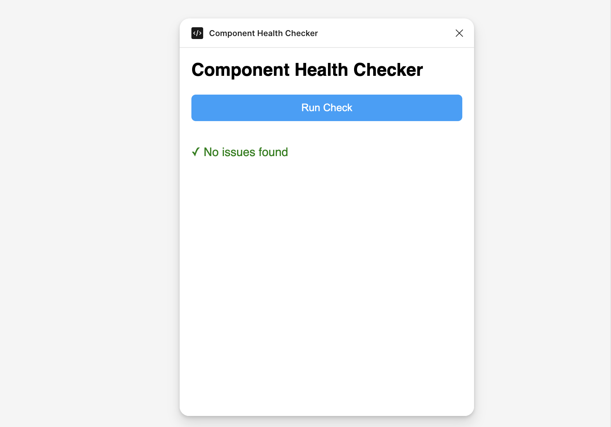

# Component Health Checker — Figma Plugin

A Figma plugin that scans your canvas and flags component issues that cause design system drift. Built as part of my design systems tooling portfolio.



## What it checks

- **Detached instances** — components that have been unlinked from their source
- **Local components** — instances using locally defined components instead of the shared library
- **Overridden properties** — instances where properties have been modified from the original

Click any flagged item to jump directly to it on the canvas.

## Why I built this

Design system drift is one of the biggest challenges in multi-product design orgs. This plugin is a lightweight tool to surface drift early — directly inside Figma where designers are already working — without requiring any external tooling or audits.

## Tech stack

- TypeScript compiled with `tsc` (no bundler)
- Vanilla HTML/JS for the UI layer
- Figma Plugin API for canvas traversal and node selection

## Getting started

### Prerequisites

- [Node.js](https://nodejs.org) v22+
- [Figma desktop app](https://figma.com/downloads/)

### Install dependencies

```bash
npm install
```

### Build the plugin

```bash
npm run build
```

This compiles `src/main.ts` into `dist/main.js`.

### Load in Figma

1. Open the Figma desktop app
2. Open any Figma document
3. Go to **Plugins → Development → Import plugin from manifest**
4. Select the `manifest.json` file in this project's root

### Debugging

Open the developer console via **Plugins → Development → Show/Hide Console**.

## How it works

The plugin uses Figma's `figma.currentPage.findAll()` to traverse all nodes on the current page and filters for `INSTANCE` type nodes. For each instance it checks:

- `node.mainComponent === null` → detached
- `node.mainComponent.remote === false` → local (not from shared library)
- `node.overrides.length > 0` → has overrides

Results are passed from the main thread to the UI via `figma.ui.postMessage()` and rendered as a clickable list.

## Future features that are nice to have

- [ ] Filter results by issue type
- [ ] Export report as CSV
- [ ] Scan specific frames or selections only
- [ ] Highlight affected nodes on canvas
- [ ] Summary stats (total instances, % healthy)

## Resources

- [Figma Plugin API docs](https://figma.com/plugin-docs/)
- [Figma Plugin Typings](https://github.com/figma/plugin-typings)
